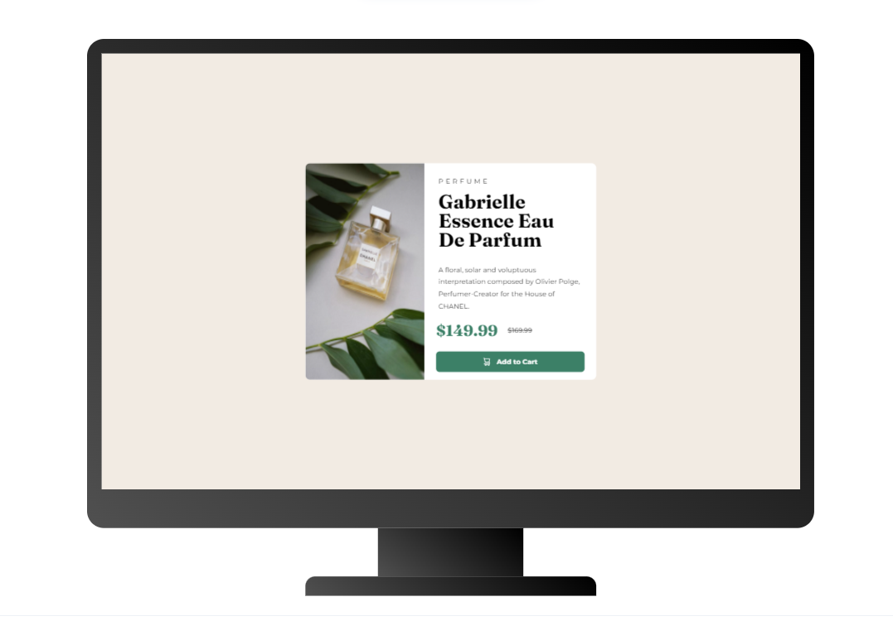
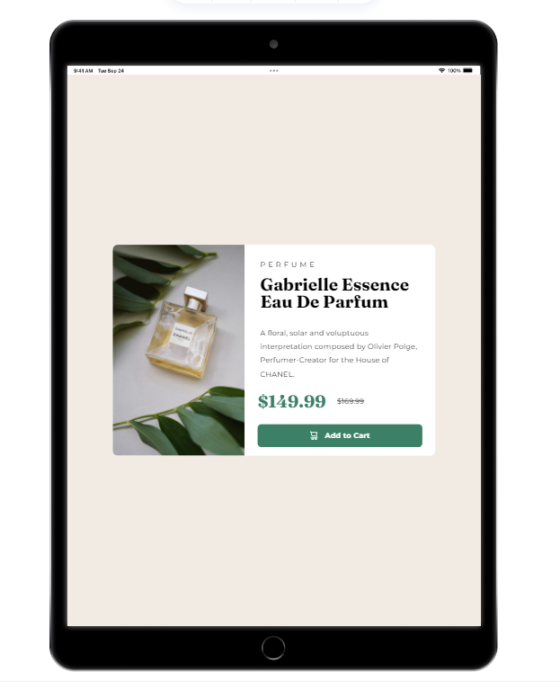
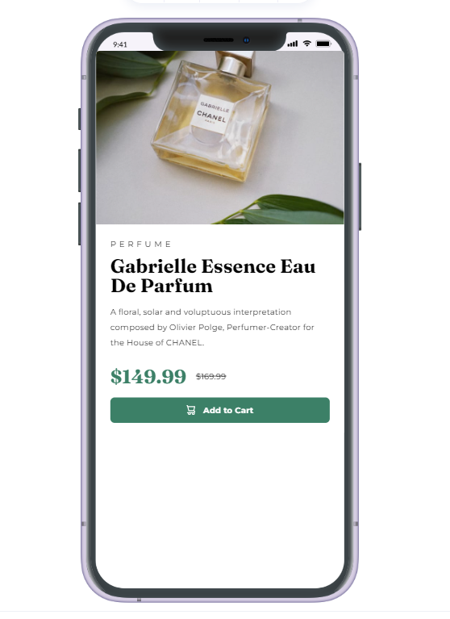

# Frontend Mentor - Product preview card component solution

This is a solution to the [Product preview card component challenge on Frontend Mentor](https://www.frontendmentor.io/challenges/product-preview-card-component-GO7UmttRfa). Frontend Mentor challenges help you improve your coding skills by building realistic projects. 

## Table of contents

- [Overview](#overview)
  - [The challenge](#the-challenge)
  - [Screenshot](#screenshot)
  - [Links](#links)
- [My process](#my-process)
  - [Built with](#built-with)
  - [Continued development](#continued-development)
  - [Useful resources](#useful-resources)
- [Author](#author)

## Overview

### The challenge

Users should be able to:

- View the optimal layout depending on their device's screen size
- See hover and focus states for interactive elements

### Screenshot

  

### Links

- Solution URL: [Add solution URL here](https://your-solution-url.com)
- Live Site URL: [Add live site URL here](https://your-live-site-url.com)

## My process

- starting building with the popular mobile-first workflow from screen size of 375px.
- used chrome develop tools to adjust the screen to my desired size.
- used lt [browser](https://www.lambdatest.com/mobile-view-website) to test responsiveness on different devices.

### Built with

- Mobile-first workflow
- SASS
- Flexbox

### Continued development

Will continue building more projects to help me grow to the developer i aim for.

### Useful resources

- [Browser for web responsiveness on different devices](https://www.lambdatest.com/mobile-view-website) - this browser lets you test you website on diff phone, tab, laptop and desktop screen sizes.

- [Chatgpt](https://chat.openai.com/) - useful site when you get stuck in a project.

## Author

- Frontend Mentor - [markorrente01](https://www.frontendmentor.io/profile/markorrente01)